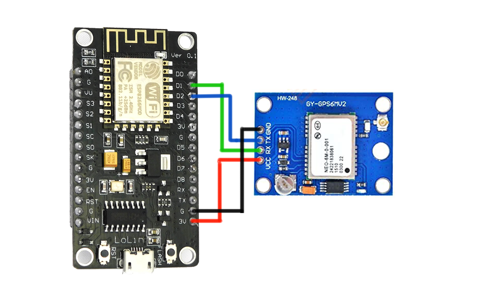

# ESP8266 , GY-NEO 6M
## Platformio

#####  aplicacion desarrollada en platformio con lenguaje c++
con las librerias
ThingSpeak
`	mathworks/ThingSpeak@^2.0.0`
Wifi
	`tzapu/WiFiManager@^0.16.0`
Fecha
	`paulstoffregen/Time@^1.6.1`
	`jchristensen/Timezone@^1.2.4`
Gps
	`adafruit/Adafruit GPS Library@^1.7.5`
### Diagrama

